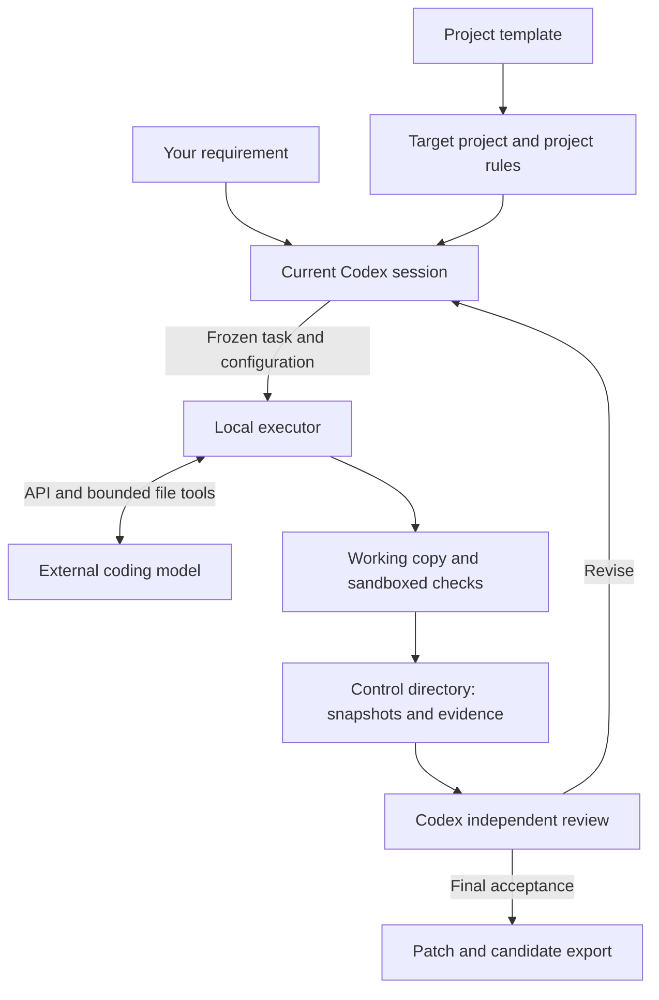

# Codex Harness

**A local execution and verification workflow coordinated by your current Codex session.**

English | [简体中文](README.zh-CN.md) | [Step-by-step setup guide (中文)](docs/GETTING-STARTED.zh-CN.md)

Codex Harness connects project requirements, an external coding model, and independent verification on Windows. Your current Codex session analyzes the project, prepares implementation and acceptance documents, dispatches work, reviews evidence, and requests revisions. A local executor provides bounded file tools, native sandboxed checks, snapshots, and recoverable state. No additional decision-model API is required; the external worker still needs its own compatible API configuration.

This repository contains the **v1.2.1 executor** and its **v1.2 project template**. The configuration version is **1.2**; the bundled, fixed protocol remains **1.0**.

The executor folder remains `codex-harness-executor-v1.2/` for path compatibility; its CLI version is **1.2.1**. The project template stays at **1.2**. See the [v1.2.1 changes](CHANGELOG.md) and [migration notes](codex-harness-executor-v1.2/MIGRATION-1.2.1.md).

## What it does

- Freezes implementation, acceptance, and test documents before dispatching a task.
- Gives the worker file-reading, search, patching, registered-check, and candidate-submission tools.
- Verifies a frozen candidate in a fresh check copy and lets Codex review the actual assertions, changes, and evidence.
- Preserves state and evidence for revisions and interrupted sessions.
- Exports a patch and candidate files after final acceptance, ready for review and merging.

## How the pieces fit together



| Component | Purpose | Placement |
|---|---|---|
| `codex-harness-executor-v1.2/` | Compiled CLI, source, examples, and historical validation records | Outside the target project |
| `codex-harness-project-template-v1.2/` | Rules and documents that Codex merges into a project | Keep the package outside the target project; merge its `project/` contents as instructed |
| `source_root` | Your target project's source and rules | The project you want to work on |
| `work_root` | Isolated workspaces and temporary check copies | Outside the target project |
| `control_root` | Frozen inputs, run state, reviews, evidence, and exports | Outside the target project and work directory |

`source_root`, `work_root`, and `control_root` must be separate: none may contain another. Local configuration and private credentials also belong outside the target project. Each target project needs its own work and control directories.

## Requirements

| Requirement | Details |
|---|---|
| Windows | The executor's production sandbox supports Windows only. |
| Node.js **24.x** | Required to run the compiled CLI; other major versions are rejected for business commands. |
| Codex session and CLI | A session coordinates the workflow. A callable native `codex.exe` must support the sandbox's explicit `--permission-profile` capability. |
| Configured `elevated` sandbox | Harness requires this backend and does not fall back to `unelevated`. |
| Git | Needed for Git workspaces and patch export, including export from a non-Git demo project. |
| Worker API | An HTTPS OpenAI-compatible Chat Completions endpoint with non-streaming function tool calls, a model ID, and credentials. A chat website alone is insufficient. |
| Project tools | Install the target project's own runtimes and services as needed, such as JDK or Maven. |

For installation, see [Node.js downloads](https://nodejs.org/en/download), [Git for Windows](https://git-scm.com/install/windows), [Codex CLI](https://learn.chatgpt.com/docs/codex/cli), and [Windows sandbox setup](https://learn.chatgpt.com/docs/windows/windows-sandbox). Harness's `elevated` requirement is stricter than Codex's general fallback options.

## Quick start

The compiled `dist/harness.mjs` includes runtime dependencies. **Using the executor does not require `npm install` or a build.** For development, the executor directory now includes the dependency lockfile and `typecheck`, `test`, `test:host`, and `build` scripts; run `npm ci` there first.

1. Download this repository using **Code → Download ZIP**, extract it, and keep both component folders outside your target project. Open PowerShell in the extracted repository directory.
2. Check Node.js and the executor:

   ```powershell
   node --version
   git --version
   .\codex-harness-executor-v1.2\harness.cmd --version
   .\codex-harness-executor-v1.2\harness.cmd --help
   ```

   Expect Node.js `v24.x.x` and executor version `1.2.1`. Help/version output alone does not verify the sandbox or model connection.

3. Use the [beginner guide](docs/GETTING-STARTED.zh-CN.md) to create a project-specific YAML configuration outside the project. Fill in `base_url`, `model`, and `api_key_env`. Store the real key in the outside-project file referenced by `private_env_file`; do not paste it into the chat or YAML. The executor appends `/chat/completions` to `base_url`.
4. Open the **target project** in Codex and send this prompt after replacing every bracketed field:

   ```text
   Target project: <absolute project path>
   Template package: <absolute path to codex-harness-project-template-v1.2>
   Executor package: <absolute path to codex-harness-executor-v1.2>
   Local configuration: <absolute path to your outside-project YAML file>

   Read the template's CODEX-SETUP.md and the executor's COORDINATOR.md.
   Merge the project rules without overwriting existing instructions or work.
   Inspect the project, register its real checks, protect acceptance inputs,
   and check the native Codex CLI path. Do not read or print the private key file.
   Run doctor --live; once it passes, initialize and record the baseline.
   For this session, complete setup only and report what actually passed.
   ```

5. After setup, give Codex a concrete requirement. It maintains the task documents, dispatches work, verifies candidates, and coordinates revisions. You do not need to carry JSON messages between models.

For a first run, follow the guide's copied addition demo. Its initial failure is intentional; run it separately from the supplied package and your real project.

## Everyday workflow

```text
doctor --live → init (first setup) → baseline

Feature: prepare → run → verify → inspect → decide
REVISE: rework instructions → repeat the feature cycle from prepare

FINAL: prepare → run → verify → inspect → decide → export
```

Codex performs the review and records `ACCEPT`, `REVISE`, or `BLOCK`. A command exiting successfully produces evidence that still needs review; it does not prove the business requirement passed. Final verification runs again after all features pass. The FINAL run freezes the candidate without calling the worker model.

For occasional manual inspection, set these two paths in a PowerShell window:

```powershell
$Harness = 'C:\Tools\codex-harness\codex-harness-executor-v1.2\harness.cmd'
$Config = 'C:\Harness\config\demo.yaml'
& $Harness doctor --config $Config --live
& $Harness status --config $Config
```

Replace the example paths first. `doctor --live` performs sandbox probes and real worker API calls; it can incur provider usage. Use `status` after initialization. All business commands require `--config`; see the [command reference](codex-harness-executor-v1.2/RUNTIME.md) for inputs and recovery commands.

Final accepted results are exported under `control_root/exports/<run-id>/`, including `changes.patch`, `before/`, `after/`, `delivery.json`, and review/evidence records. Review the export against your current source before applying it. Harness does not automatically merge, commit, push, or publish.

In v1.2.1, `resume` only accepts the current recoverable run; cancelled, completed, or superseded runs cannot overwrite current state. Export rechecks the current FINAL and its frozen feature approvals, including when a delivery already exists. Old FINAL records without that approval list require a new FINAL specification version and revalidation.

Check stdout/stderr are saved as complete, redacted files with previews capped at 64 KiB per stream. The default saved-log limit is 256 MiB per check including initialization; incomplete capture cannot pass verification. Read a registered log with `inspect --run <ID> --log <reference> --byte-offset 0`, then use `next_byte_offset`.

## Execution boundaries

- **Trusted local mode:** the v1.2 template explicitly selects `trusted_local` with `network: true`. It permits ordinary file reads and network access while protecting designated source, control, private-key, and Codex-private paths. Check writes are limited to the check copy and its temporary directory, and acceptance inputs are read-only. Use it for project code you trust; it does not promise general read isolation or offline execution.
- **Native sandbox remains required:** Harness does not alter Windows firewall settings. Codex's own elevated-sandbox setup can make system changes as described in its official documentation. If a desktop outer sandbox prevents nested startup, only the trusted coordinator CLI should run with the necessary host permission; project checks still use the native sandbox.
- **One worker at a time:** configure several named executors if needed, then select one with `workflow.active_executor` or `run --executor`. There is no parallel dispatch or automatic provider failover.
- **Bounded revisions:** at most 10 rounds per feature per batch, with a pause after 3 consecutive rounds without progress. Ordinary recovery preserves counters; an explicitly authorized new batch preserves history.
- **Session-driven lifecycle:** no background decision service continues the coordination when the Codex session closes. Keep the work and control directories for recovery.

## Documentation

Most component reference documents are currently in Chinese.

| Document | Read it for |
|---|---|
| [Beginner guide](docs/GETTING-STARTED.zh-CN.md) | Installation, configuration, first demo, daily use, and troubleshooting |
| [Project setup instructions](codex-harness-project-template-v1.2/CODEX-SETUP.md) | The setup procedure to give to Codex |
| [New computer notes](codex-harness-project-template-v1.2/NEW-COMPUTER.md) | Rebinding paths and preparing a different machine |
| [Coordinator instructions](codex-harness-executor-v1.2/COORDINATOR.md) | Dispatch, independent review, revision, and delivery |
| [Runtime reference](codex-harness-executor-v1.2/RUNTIME.md) | Commands, configuration, state, and execution boundaries |
| [Configuration example](codex-harness-executor-v1.2/examples/harness.config.yaml) | Available settings and a multiple-executor example |
| [v1.2 migration](codex-harness-executor-v1.2/MIGRATION-1.2.md) | Configuration and validation changes from earlier versions |
| [Validation records](codex-harness-executor-v1.2/VALIDATION.md) | Historical checks and their limitations |
| [Fixed protocol v1](codex-harness-project-template-v1.2/project/docs/harness/protocol-v1/README.md) | The preserved protocol specification; keep project customizations outside this directory |

## Validation status

The supplied [v1.2.1 validation record](codex-harness-executor-v1.2/VALIDATION-V1.2.1.md), dated **2026-09-23**, reports **97 regression checks and 8 native-host checks passing**, plus successful TypeScript checking and compilation. A simulated worker completed failure, revision, repair, final verification, and export. Real-model integration was not rerun for this patch. Its recorded environment was Windows, Node.js `24.21.0`, and Codex CLI `0.155.0-alpha.16`.

These are historical package records for a specific machine, configuration, and test project. They are not a guarantee that a different CLI, provider, or project works. On your machine, run `doctor --live`, record the actual project baseline, and review real test assertions and required artifacts. Zero executed tests do not establish business acceptance.

The packaged demo has **two assertions** and starts with `a - b`; the historical live exercise used a separate four-case fixture. Follow the files actually present in your demo rather than copying historical test counts.
