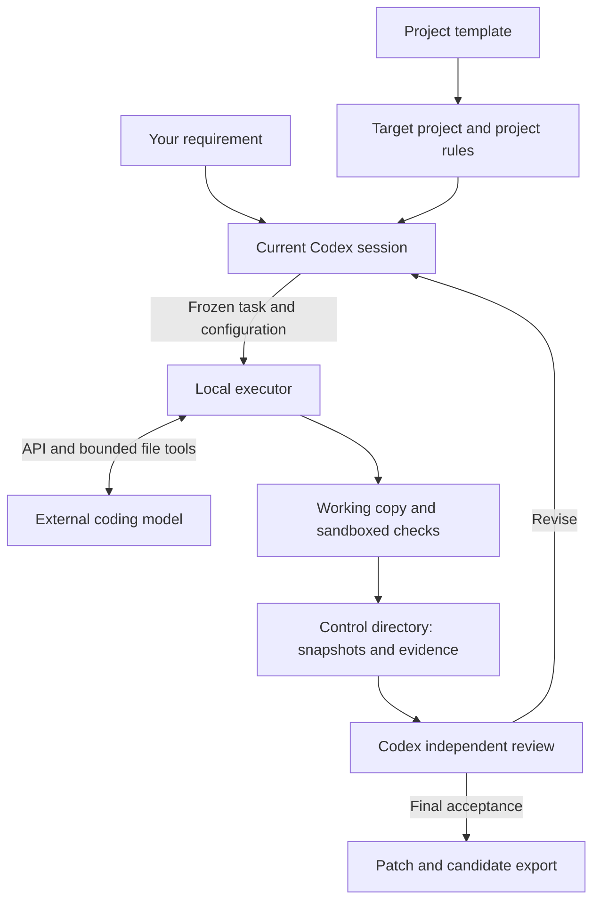

# Codex Harness

**A local execution and verification workflow coordinated by your current Codex session.**

English | [简体中文](README.zh-CN.md) | [Workbench guide (中文)](docs/CONSOLE.zh-CN.md) | [Advanced setup (中文)](docs/GETTING-STARTED.zh-CN.md)

Codex Harness connects project requirements, an external coding model, and independent verification on Windows. Your current Codex session analyzes the project, prepares implementation and acceptance documents, dispatches work, reviews evidence, and requests revisions. A local executor provides bounded file tools, native sandboxed checks, snapshots, and recoverable state. No additional decision-model API is required; the external worker still needs its own compatible API configuration.

This repository contains the **v1.3.0 executor** and its **v1.3 project template**. The configuration version is **1.3**; the bundled, fixed protocol remains **1.0**.

Both component folder names retain `v1.2` for path compatibility. Version 1.3 adds `onboard`, project document freezing with `prepare --docs`, automatic reports, JUnit/TAP test counts, and provider token/storage statistics. Zero executed tests or invalid reports cannot support acceptance. See the [changes](CHANGELOG.md), [migration and command reference](codex-harness-executor-v1.2/MIGRATION-1.3.md), and [validation record](codex-harness-executor-v1.2/VALIDATION-V1.3.md).

**First run: install Node.js 24, extract the complete repository, and double-click `codex-harness-executor-v1.2\启动工作台.cmd`. The frontend is bundled; no separate frontend installation or development server is required.**

## What it does

- Provides a local browser workbench for folder-based project onboarding, worker AI settings, task history, public model output, and verification evidence.
- Freezes implementation, acceptance, and test documents before dispatching a task.
- Gives the worker file-reading, search, patching, registered-check, and candidate-submission tools.
- Verifies a frozen candidate in a fresh check copy and lets Codex review the actual assertions, changes, and evidence.
- Preserves state and evidence for revisions and interrupted sessions.
- Exports a patch and candidate files after final acceptance, ready for review and merging.

## How the pieces fit together


```mermaid
flowchart TD
    U[Your requirement] --> C[Current Codex session]
    T[Project template] --> P[Target project and project rules]
    P --> C
    C -->|Frozen task and configuration| E[Local executor]
    E <-->|API and bounded file tools| W[External coding model]
    E --> S[Working copy and sandboxed checks]
    S --> D[Control directory: snapshots and evidence]
    D --> R[Codex independent review]
    R -->|Revise| C
    R -->|Final acceptance| X[Patch and candidate export]
```

| Component | Purpose | Placement |
|---|---|---|
| `codex-harness-executor-v1.2/` | Compiled CLI, source, examples, and historical validation records | Outside the target project |
| `codex-harness-project-template-v1.2/` | Rules and documents that Codex merges into a project | Keep the package outside the target project; merge its `project/` contents as instructed |
| `source_root` | Your target project's source and rules | The project you want to work on |
| `work_root` | Isolated workspaces and temporary check copies | Outside the target project |
| `control_root` | Frozen inputs, run state, reviews, evidence, and exports | Outside the target project and work directory |

`source_root`, `work_root`, and `control_root` must be separate: none may contain another. Local configuration and private credentials also belong outside the target project. Each target project needs its own work and control directories.

## Requirements

| Requirement | Details |
|---|---|
| Windows | The executor's production sandbox supports Windows only. |
| Node.js **24.x** | Required to run the compiled CLI; other major versions are rejected for business commands. |
| Codex session and CLI | A session coordinates the workflow. A callable native `codex.exe` must support the sandbox's explicit `--permission-profile` capability. |
| Configured `elevated` sandbox | Harness requires this backend and does not fall back to `unelevated`. |
| Git | Needed for Git workspaces and patch export, including export from a non-Git demo project. |
| Worker API | An HTTPS OpenAI-compatible Chat Completions endpoint with non-streaming function tool calls, a model ID, and credentials. A chat website alone is insufficient. |
| Project tools | Install the target project's own runtimes and services as needed, such as JDK or Maven. |

For installation, see [Node.js downloads](https://nodejs.org/en/download), [Git for Windows](https://git-scm.com/install/windows), [Codex CLI](https://learn.chatgpt.com/docs/codex/cli), and [Windows sandbox setup](https://learn.chatgpt.com/docs/windows/windows-sandbox). Harness's `elevated` requirement is stricter than Codex's general fallback options.

## Quick start

The local executor serves the frontend and authenticated API together. **No `npm install`, `npm run dev`, separate web deployment, or GitHub Pages setup is required for normal use.** Keep the complete distribution, including `dist/harness.mjs`, `dist/ui/`, `dist/harness-picker.exe`, and the bundled onboarding template. Node.js 24 must be installed separately.

1. Download this repository using **Code → Download ZIP** and extract it outside your target project, for example to `C:\Tools\codex-harness`. Do not run it inside the ZIP or download only the HTML/CLI file. Open PowerShell in the extracted repository directory.
2. Check Node.js and the executor:

   ```powershell
   node --version
   git --version
   .\codex-harness-executor-v1.2\harness.cmd --version
   .\codex-harness-executor-v1.2\harness.cmd --help
   ```

   Expect Node.js `v24.x.x` and executor version `1.3.0`. Help/version output alone does not verify the sandbox or model connection.

3. Double-click `codex-harness-executor-v1.2\启动工作台.cmd` to start the service in the background and open your browser. The command-line alternative, from the repository root, is:

   ```powershell
   .\codex-harness-executor-v1.2\harness.cmd ui --reuse
   ```

   The default address is `http://127.0.0.1:4317/`; another available port is selected if needed. Use the browser opened by the launcher, which establishes the local session. Do not bookmark token-bearing URLs or keep using an old service tab. Keep the terminal open when starting a new service with the CLI; the double-click launcher runs it in the background.

4. Choose **添加项目 → 接入项目文件夹** (Add project → Project folder), select your project, and enter the worker API address, model and key. Click **检测项目** (Detect), review the tools, file changes and commands, then explicitly consent and click **一键接入** (Onboard). Maven and Node.js have automatic presets; existing YAML files can be imported. Preflight makes real provider calls and onboarding installs dependencies and runs project scripts. Keys stay in private local files outside the source repository.
5. Open the **target project** in Codex and send this prompt after replacing every bracketed field:

   ```text
   Project already onboarded through Harness: <absolute project path>
   Executor package: <absolute path to codex-harness-executor-v1.2>
   Project ID: <shown in the workbench project settings>

   Read AGENTS.md, docs/harness/README.md, and COORDINATOR.md.
   Inspect real code and complete the project profile while preserving existing work.
   Use the project ID to resolve the selected configuration; do not reinitialize
   the project or read/print private keys.
   My requirement is: <goal and constraints>.
   Prepare implementation, acceptance and test documents before dispatching
   the worker, then independently verify the actual results.
   ```

Initialization is not business acceptance. Onboarding installs generic rules; Codex still needs to write project-specific guidance and task documents. Zero tests, skipped tests and missing reports are not passes. Repeating onboarding does not add tests to its initial snapshot. Later task verification is shown separately, and exports still need review before merging.

For manual YAML setup and the copied addition demo, use the [advanced guide](docs/GETTING-STARTED.zh-CN.md).

## Reopening the workbench

Double-click `启动工作台.cmd` after closing the browser or rebooting Windows. It reuses a healthy local instance and preserves local project registrations. It does not configure automatic startup. Closing the browser does not cancel an onboarding job running in the service.

To create an optional **Harness 工作台** desktop shortcut, run this from the repository root:

```powershell
powershell.exe -NoProfile -ExecutionPolicy Bypass -File .\codex-harness-executor-v1.2\scripts\install-desktop-shortcut.ps1
```

Recreate the shortcut after moving the installation. Before upgrading, wait for active jobs to finish and identify and stop the old Harness service before launching the new version. Refreshing a tab does not reload backend code. Do not terminate all Node.js processes.

The workbench is loopback-only, not a hosted multi-user website. Other users install their own tools, configure their own AI and onboard their own projects. Downloading this repository does not transfer your private keys or project history. See the [workbench guide](docs/CONSOLE.zh-CN.md) for ports, sessions and recovery.

## Developing the workbench

Only source development requires dependency installation and rebuilding:

```powershell
cd .\codex-harness-executor-v1.2
npm ci
npm run typecheck
npm run build
.\harness.cmd ui --reuse
```

Frontend sources are in `src/console/web/`; compiled assets are in `dist/ui/` and served on the same port. Restart an idle existing service to load changed backend code. Test commands are `npm test`, `npm run test:ui`, and `npm run test:host`; native sandbox checks need a Windows host environment.

## Everyday workflow

```text
doctor --live → init (first setup) → baseline

Feature: prepare → run → verify → inspect → decide
REVISE: rework instructions → repeat the feature cycle from prepare

FINAL: prepare → run → verify → inspect → decide → export
```

Codex performs the review and records `ACCEPT`, `REVISE`, or `BLOCK`. A command exiting successfully produces evidence that still needs review; it does not prove the business requirement passed. Final verification runs again after all features pass. The FINAL run freezes the candidate without calling the worker model.

For occasional manual inspection, set these two paths in a PowerShell window:

```powershell
$Harness = 'C:\Tools\codex-harness\codex-harness-executor-v1.2\harness.cmd'
$Config = 'C:\Harness\config\demo.yaml'
& $Harness doctor --config $Config --live
& $Harness status --config $Config
```

Replace the example paths first. `doctor --live` performs sandbox probes and real worker API calls; it can incur provider usage. Use `status` after initialization. Business commands accept either `--project-id <ID>` or explicit `--config <path>`, never both. Project IDs follow the selected workbench configuration; fixed YAML paths do not. See the [command reference](codex-harness-executor-v1.2/RUNTIME.md) for inputs and recovery commands.

Final accepted results are exported under `control_root/exports/<run-id>/`, including `changes.patch`, `before/`, `after/`, `delivery.json`, and review/evidence records. Review the export against your current source before applying it. Harness does not automatically merge, commit, push, or publish.

In v1.2.1, `resume` only accepts the current recoverable run; cancelled, completed, or superseded runs cannot overwrite current state. Export rechecks the current FINAL and its frozen feature approvals, including when a delivery already exists. Old FINAL records without that approval list require a new FINAL specification version and revalidation.

Check stdout/stderr are saved as complete, redacted files with previews capped at 64 KiB per stream. The default saved-log limit is 256 MiB per check including initialization; incomplete capture cannot pass verification. Read a registered log with `inspect --run <ID> --log <reference> --byte-offset 0`, then use `next_byte_offset`.

## Execution boundaries

- **Trusted local mode:** the v1.2 template explicitly selects `trusted_local` with `network: true`. It permits ordinary file reads and network access while protecting designated source, control, private-key, and Codex-private paths. Check writes are limited to the check copy and its temporary directory, and acceptance inputs are read-only. Use it for project code you trust; it does not promise general read isolation or offline execution.
- **Native sandbox remains required:** Harness does not alter Windows firewall settings. Codex's own elevated-sandbox setup can make system changes as described in its official documentation. If a desktop outer sandbox prevents nested startup, only the trusted coordinator CLI should run with the necessary host permission; project checks still use the native sandbox.
- **One worker at a time:** configure several named executors if needed, then select one with `workflow.active_executor` or `run --executor`. There is no parallel dispatch or automatic provider failover.
- **Bounded revisions:** at most 10 rounds per feature per batch, with a pause after 3 consecutive rounds without progress. Ordinary recovery preserves counters; an explicitly authorized new batch preserves history.
- **Session-driven lifecycle:** no background decision service continues the coordination when the Codex session closes. Keep the work and control directories for recovery.

## Documentation

Most component reference documents are currently in Chinese.

| Document | Read it for |
|---|---|
| [Workbench guide (中文)](docs/CONSOLE.zh-CN.md) | Browser startup, visual onboarding, AI settings, configuration switching and task evidence |
| [Publishing checklist (中文)](docs/PUBLISHING.zh-CN.md) | Distribution completeness and privacy checks before a GitHub upload |
| [Beginner guide](docs/GETTING-STARTED.zh-CN.md) | Installation, configuration, first demo, daily use, and troubleshooting |
| [Project setup instructions](codex-harness-project-template-v1.2/CODEX-SETUP.md) | The setup procedure to give to Codex |
| [New computer notes](codex-harness-project-template-v1.2/NEW-COMPUTER.md) | Rebinding paths and preparing a different machine |
| [Coordinator instructions](codex-harness-executor-v1.2/COORDINATOR.md) | Dispatch, independent review, revision, and delivery |
| [Runtime reference](codex-harness-executor-v1.2/RUNTIME.md) | Commands, configuration, state, and execution boundaries |
| [Configuration example](codex-harness-executor-v1.2/examples/harness.config.yaml) | Available settings and a multiple-executor example |
| [v1.2 migration](codex-harness-executor-v1.2/MIGRATION-1.2.md) | Configuration and validation changes from earlier versions |
| [Validation records](codex-harness-executor-v1.2/VALIDATION.md) | Historical checks and their limitations |
| [Fixed protocol v1](codex-harness-project-template-v1.2/project/docs/harness/protocol-v1/README.md) | The preserved protocol specification; keep project customizations outside this directory |

## Validation status

The [v1.3.0 validation record](codex-harness-executor-v1.2/VALIDATION-V1.3.md) reports **118 regression tests and 10 Windows host tests passing**, plus type checking, compilation, and compiled CLI smoke checks. Simulated-provider onboarding and the failure → revision → FINAL → export workflow were exercised. Real-provider integration was not run for this release.

The supplied [v1.2.1 validation record](codex-harness-executor-v1.2/VALIDATION-V1.2.1.md), dated **2026-09-23**, reports **97 regression checks and 8 native-host checks passing**, plus successful TypeScript checking and compilation. A simulated worker completed failure, revision, repair, final verification, and export. Real-model integration was not rerun for this patch. Its recorded environment was Windows, Node.js `24.21.0`, and Codex CLI `0.155.0-alpha.16`.

These are historical package records for a specific machine, configuration, and test project. They are not a guarantee that a different CLI, provider, or project works. On your machine, run `doctor --live`, record the actual project baseline, and review real test assertions and required artifacts. Zero executed tests do not establish business acceptance.

The packaged demo has **two assertions** and starts with `a - b`; the historical live exercise used a separate four-case fixture. Follow the files actually present in your demo rather than copying historical test counts.
