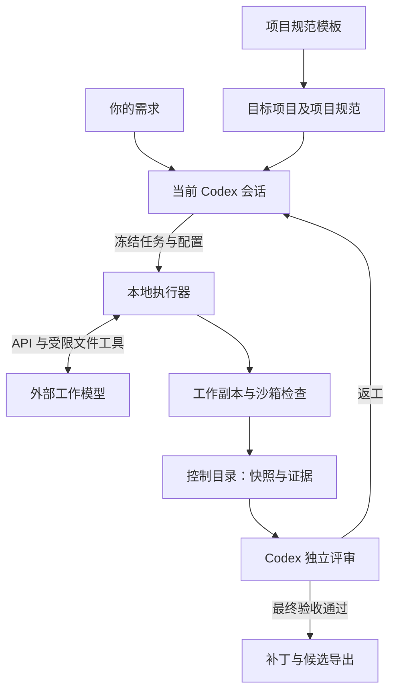

# Codex Harness

**由当前 Codex 会话协调的本地执行与独立验收工作流。**

[English](README.md) | 简体中文 | [从零开始的安装使用教程](docs/GETTING-STARTED.zh-CN.md)

Codex Harness 在 Windows 上把项目需求、外部工作模型和独立验证串成完整流程。当前 Codex 会话负责分析项目、编写实现与验收文档、派发任务、审查证据和安排返工；本地执行器提供受限文件工具、原生沙箱检查、快照和状态恢复。无需额外接入一个决策模型 API；外部工作模型仍需要单独配置兼容的 API。

本仓库包含 **v1.3.0 执行器**和配套的 **v1.3 项目规范模板**。配置版本为 **1.3**，随包保留的固定协议版本仍为 **1.0**。

为兼容已有启动路径，两个组件目录名仍保留 `v1.2`。新增 `onboard` 接入向导、`prepare --docs` 文档冻结、`report` 过程报告和 `stats` 用量/空间统计；JUnit XML/TAP 支持真实测试计数，零执行或无效报告不能支持验收。详见[更新记录](CHANGELOG.md)、[v1.3 用法与迁移](codex-harness-executor-v1.2/MIGRATION-1.3.md)和[本版验证记录](codex-harness-executor-v1.2/VALIDATION-V1.3.md)。

## 可以做什么

- 在派发任务前冻结实现文档、验收文档和测试文档。
- 向工作模型提供文件读取、代码搜索、补丁、已登记检查和候选提交工具。
- 在全新检查副本中验证冻结候选，由 Codex 审查真实断言、代码差异和证据。
- 保存状态与证据，支持返工和会话中断后的恢复。
- 最终验收通过后导出补丁和候选文件，供审查、合并。

## 各部分如何配合



| 组成 | 用途 | 放置位置 |
|---|---|---|
| `codex-harness-executor-v1.2/` | 已编译 CLI、源码、示例和历史验证记录 | 目标项目之外 |
| `codex-harness-project-template-v1.2/` | 由 Codex 合并进目标项目的规则和文档 | 原包保留在目标项目外，按接入说明合并其中的 `project/` 内容 |
| `source_root` | 目标项目的源码与规范 | 你希望修改的项目目录 |
| `work_root` | 独立工作区与临时检查副本 | 目标项目之外 |
| `control_root` | 冻结输入、运行状态、评审、证据和导出成果 | 目标项目与工作目录之外 |

`source_root`、`work_root`、`control_root` 必须互不包含。本机配置和私有凭据也应放在目标项目外。每个目标项目使用独立的工作目录和控制目录。

## 环境要求

| 条件 | 说明 |
|---|---|
| Windows | 执行器的生产沙箱目前仅支持 Windows。 |
| Node.js **24.x** | 用于运行已编译 CLI；业务命令会拒绝其他大版本。 |
| Codex 会话与 CLI | 由会话协调流程；需要能调用原生 `codex.exe`，且其沙箱支持显式 `--permission-profile` 能力。 |
| 已设置的 `elevated` 沙箱 | Harness 要求此后端，不会回退到 `unelevated`。 |
| Git | Git 工作区及补丁导出需要 Git；非 Git 示例的导出也需要。 |
| 工作模型 API | HTTPS、兼容 OpenAI Chat Completions、支持非流式函数工具调用，并提供模型 ID 和凭据。只有网页聊天入口不够。 |
| 项目运行环境 | 按目标项目实际需要安装 JDK、Maven 等运行时、工具和服务。 |

安装来源：[Node.js 下载](https://nodejs.org/en/download)、[Git for Windows](https://git-scm.com/install/windows)、[Codex CLI](https://learn.chatgpt.com/docs/codex/cli)、[Windows 沙箱设置](https://learn.chatgpt.com/docs/windows/windows-sandbox)。Harness 对 `elevated` 的要求比 Codex 通用说明中的备用方案更严格。

## 快速开始

已编译的 `dist/harness.mjs` 包含运行依赖，**使用执行器无需 `npm install` 或自行构建**。需要开发执行器时，在执行器目录先运行 `npm ci`，再使用已提供的 `typecheck`、`test`、`test:host` 和 `build` 脚本。

1. 在本仓库点击 **Code → Download ZIP**，解压后将两个组件目录保留在目标项目之外。在解压后的仓库目录打开 PowerShell。
2. 检查 Node.js 和执行器：

   ```powershell
   node --version
   git --version
   .\codex-harness-executor-v1.2\harness.cmd --version
   .\codex-harness-executor-v1.2\harness.cmd --help
   ```

   Node.js 应显示 `v24.x.x`，执行器应显示 `1.3.0`。帮助和版本输出正常，不代表沙箱或模型连接已经通过验证。

3. 按[新手教程](docs/GETTING-STARTED.zh-CN.md)在项目外创建专用 YAML 配置，填写 `base_url`、`model` 和 `api_key_env`。真实 Key 只在本机填写到 `private_env_file` 指向的项目外文件，不粘贴到聊天或 YAML。执行器会在 `base_url` 后追加 `/chat/completions`。
4. 在 Codex 中打开**目标项目**，替换下面所有尖括号内容后发送：

   ```text
   目标项目：<项目绝对路径>
   规范模板包：<codex-harness-project-template-v1.2 的绝对路径>
   执行器包：<codex-harness-executor-v1.2 的绝对路径>
   本机配置：<项目外 YAML 文件的绝对路径>

   请阅读模板包 CODEX-SETUP.md 和执行器 COORDINATOR.md。
   保留已有规则和改动，合并项目规范；分析项目，登记真实检查命令，
   保护验收输入，并核对原生 Codex CLI 路径。不要读取或打印私有 Key 文件。
   运行 doctor --live，通过后初始化并记录基线。
   本次只完成接入，报告实际通过的检查。
   ```

5. 接入完成后向 Codex 提出具体需求。任务文档、派发、候选验证和返工由当前会话协调，无需你在模型之间搬运 JSON。

第一次使用建议按教程复制自带加法示例。它初始失败是故意设计的，应与发行包原件及真实项目分开放置。

## 日常流程

```text
doctor --live → init（首次接入）→ baseline

功能：prepare → run → verify → inspect → decide
REVISE：生成返工单 → 从 prepare 开始重复功能流程

FINAL：prepare → run → verify → inspect → decide → export
```

Codex 审查结果并记录 `ACCEPT`、`REVISE` 或 `BLOCK`。命令成功退出所产生的证据仍需评审，不能直接证明业务需求通过。全部功能通过后，还要重新运行最终验证。FINAL 的 run 只冻结候选，不调用工作模型。

需要手动检查时，先在 PowerShell 窗口设置以下两个路径：

```powershell
$Harness = 'C:\Tools\codex-harness\codex-harness-executor-v1.2\harness.cmd'
$Config = 'C:\Harness\config\demo.yaml'
& $Harness doctor --config $Config --live
& $Harness status --config $Config
```

先替换成自己的实际路径。`doctor --live` 会执行沙箱探针并真实调用工作模型 API，可能产生供应商用量。`status` 用于初始化之后。所有业务命令都需要 `--config`；参数和恢复命令见[运行接口说明](codex-harness-executor-v1.2/RUNTIME.md)。

最终通过的成果导出到 `control_root/exports/<run-id>/`，包含 `changes.patch`、`before/`、`after/`、`delivery.json` 及评审和证据记录。应用前先与当前源码比较。Harness 不会自动合并、提交、推送或发布。

v1.2.1 的 `resume` 只接受当前可恢复运行，历史、已取消和已完成运行不能覆盖当前状态。导出会重新核对当前 FINAL 及其冻结的功能审批依据，已有交付目录也不能绕过。旧 FINAL 缺少该清单时，需要提高 FINAL 规范版本并重新验收。

检查日志完整脱敏落盘，每路预览最多 64 KiB；一次检查连同初始化默认合计最多保存 256 MiB，日志不完整不能通过。使用 `inspect --run <ID> --log <引用> --byte-offset 0` 读取已登记日志，再按 `next_byte_offset` 继续。

## 执行边界

- **可信本机模式**：v1.2 模板明确选择 `trusted_local` 与 `network: true`。普通读取和联网允许，指定的原项目、控制目录、私有 Key 文件和 Codex 私有路径受保护；检查写入限于检查副本及其临时目录，验收输入只读。适用于你信任的项目代码，不承诺全面读取隔离或断网。
- **仍需原生沙箱**：Harness 不修改 Windows 防火墙设置；Codex 自身的 elevated 沙箱初始化可能按官方说明进行系统配置。如果桌面外层沙箱阻止嵌套启动，只为可信协调者 CLI 提供必要宿主权限，项目检查仍进入原生沙箱。
- **一次选择一个工作模型**：可配置多个具名执行者，由 `workflow.active_executor` 或 `run --executor` 选择；不并行派发，也不自动切换供应商。
- **返工有上限**：每功能每批次最多 10 轮，连续 3 轮无进展暂停。普通恢复保留计数；明确授权的新批次也保留历史。
- **由会话驱动**：关闭 Codex 会话后，没有后台决策服务继续协调。恢复时需要保留工作目录和控制目录。

## 文档导航

组件级参考文档目前主要为中文。

| 文档 | 用途 |
|---|---|
| [新手使用教程](docs/GETTING-STARTED.zh-CN.md) | 安装、配置、第一个示例、日常使用和排错 |
| [项目接入步骤](codex-harness-project-template-v1.2/CODEX-SETUP.md) | 交给 Codex 执行的接入说明 |
| [新电脑说明](codex-harness-project-template-v1.2/NEW-COMPUTER.md) | 换电脑时重新绑定路径与环境 |
| [协调者执行约定](codex-harness-executor-v1.2/COORDINATOR.md) | 派发、独立评审、返工和交付 |
| [运行接口说明](codex-harness-executor-v1.2/RUNTIME.md) | 命令、配置、状态和执行边界 |
| [配置示例](codex-harness-executor-v1.2/examples/harness.config.yaml) | 可用配置及多个执行者的示例 |
| [v1.2 迁移说明](codex-harness-executor-v1.2/MIGRATION-1.2.md) | 相对旧版的配置与验收变化 |
| [验证记录](codex-harness-executor-v1.2/VALIDATION.md) | 历史检查和适用范围 |
| [固定协议 v1](codex-harness-project-template-v1.2/project/docs/harness/protocol-v1/README.md) | 保留的协议规范；项目定制放在该目录之外 |

## 验证状态

本版 [v1.3.0 验证记录](codex-harness-executor-v1.2/VALIDATION-V1.3.md)：**118 项回归、10 项 Windows 宿主检查通过**，typecheck、build 与编译 CLI 冒烟通过。模拟供应商接入及失败→返工→FINAL→导出闭环已验证；本版未执行真实供应商联调。

随包的 [v1.2.1 验证记录](codex-harness-executor-v1.2/VALIDATION-V1.2.1.md)日期为 **2026-09-23**，记录了 **97 项回归检查、8 项原生宿主检查全部通过**，TypeScript 与编译通过。模拟模型完成失败、返工、修复、最终验证和导出；本次补丁没有重新执行真实模型联调。记录环境为 Windows、Node.js `24.21.0`、Codex CLI `0.155.0-alpha.16`。

这些是特定机器、配置与测试项目的历史发行记录，不保证另一版本 CLI、供应商或项目一定可用。你的机器仍需运行 `doctor --live`，记录真实项目基线，并审查实际测试断言及必需产物。执行了零个测试用例，不能认定业务验收通过。

包内加法示例有**两个断言**，初始实现为 `a - b`；历史联调使用的是另一个含四项用例的项目。请以当前示例文件为准，不照搬历史用例数量。
