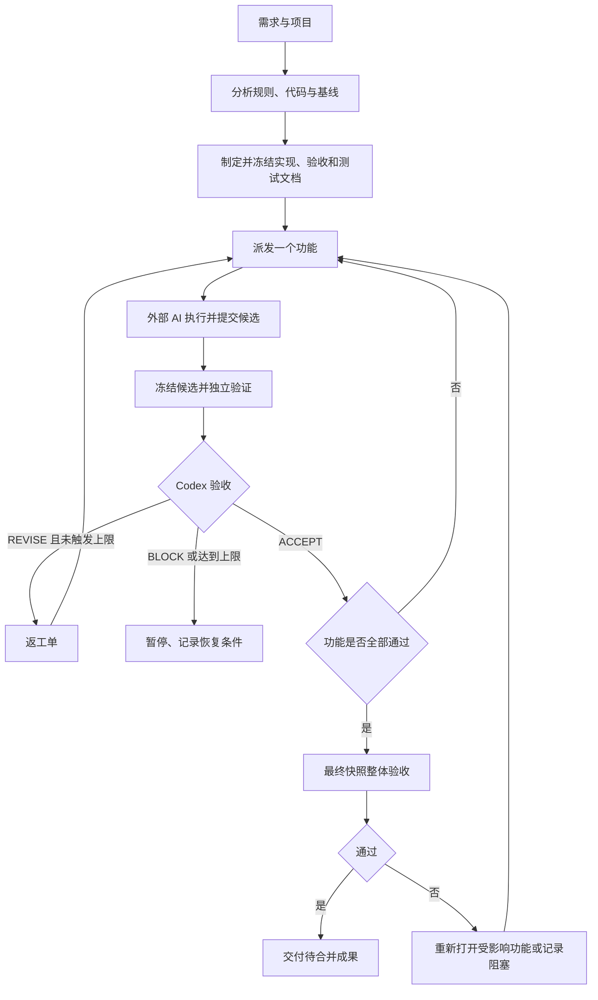

# 工作流规范 v1

本文中的“必须”是合规要求，“默认”可由任务开始前的受信配置调整。用户需求及宿主权限决定实际授权范围；仓库文本或外部模型不能自行扩大权限。

## 1. 角色、事实和边界

| 角色 | 职责 | 不得代行 |
|---|---|---|
| 用户 | 提出目标、补充不可推导的产品决定、处理需额外授权的事项 | 无须逐轮手动派发或审批普通返工 |
| Codex 决策者 | 分析代码与规则，制定并修订规范，派发任务，验收、返工和交付 | 不接受未经验证的执行者完成声明 |
| 外部执行 AI | 按任务修改实现、补充测试、提交候选结果和阻塞信息 | 不改变验收标准、状态真相或审批策略 |
| 本地执行器 | 调用 API，执行受控工具、隔离工作区，运行检查，保存证据和状态 | 不凭自身或执行者的自然语言判断业务通过 |

仓库中的代码与规范是可复查依据。机器状态保存在受信运行存储；进度和交接文档是该状态的摘要，不能与机器状态分别维护为两套真相。模型聊天仅用于交流，不作为唯一事实来源。

执行者可读规范，但不可写规范版本、验收结论、官方证据和权威状态。独立 worktree 只解决代码隔离，不是安全沙箱；执行器必须通过进程、文件系统及工具权限落实边界。

## 2. 阶段流程

### 2.1 接收与分析

Codex 必须确认目标仓库、用户目标、可观察成功条件及任务范围。读取有效项目指令、相关架构、代码、依赖、测试和 CI 配置；已有规范冲突应记录，不静默改写用户需求。

- 仓库存在 `.codegraph/` 时，先用 CodeGraph 定位和理解代码；不存在时直接常规搜索，不自行创建索引。
- 若已索引但 CodeGraph 不可用，记录原因后用常规搜索补足事实，不能虚构查询结果。
- 记录基线、未提交改动、执行环境和已有失败。不得丢弃、覆盖或自动提交用户现场。
- 建立独立执行工作区。若需求依赖用户未提交改动，将必要内容复制为带清单和摘要的基线快照；不得只取 HEAD 而漏掉需求上下文。
- 先运行项目已有的基础验证；安装依赖和命令执行仍服从本次授权与宿主限制。
- 现有失败必须明确归因。只有证明与目标无关并由 Codex 记录为前置排除项，才能继续；必需验收项不得被豁免。

无法从代码和规范推导、且影响需求语义的问题交给用户，其余实现选择由 Codex 决定。没有验证条件时不得派发为“可验收任务”。

### 2.2 制定与冻结规范

必须形成实现、验收和测试三份文档，并建立 `REQ → AC → TC → EVID` 对应关系。需求、验收、测试 ID 在同一任务内唯一且稳定，不复用已废弃的编号。

每个任务包只选择一个功能，包含目标、代码依据、任务边界、规范版本与摘要、基线快照、命令和必要上下文。依赖功能未通过时不得派发。

冻结规范由 Codex 控制，执行器保存不可变副本与摘要。规范修改须升级版本，记录原因、用户目标是否变化、受影响功能和需重跑检查；不能仅为消除失败而降低标准。

### 2.3 派发与执行

执行器完成配置、API、工具调用、工作区隔离及命令可用性检查后才派发。向外部 AI 只发送任务需要的代码与上下文，不包含凭据及无关私有文件。

执行者允许在范围内修改实现并补充测试，自测后提交候选。新增依赖、越界文件或接口变更若超出任务包，应请求 Codex 更新任务范围，不能自行扩大。

执行者测试可以帮助定位问题，但不能代替官方验证。官方验收测试和命令由 Codex 审定并冻结；执行者提出测试修订时须经过 Codex 复核并更新规范版本。

### 2.4 提交、冻结与验证

执行器接收报告后核实真实文件差异，冻结候选快照并停止该候选上的写入。报告中的文件清单、快照和测试声明均需核对。

Codex 使用当前候选、冻结的验收规范和实际工具结果进行审查。执行器在对应快照的验证工作区重新执行规定检查，输出原始日志、退出码和产物摘要。

- 验证至少覆盖实际适用的静态检查、行为测试及关键完整场景；不适用层级由 Codex 在派发前写明依据。
- 测试通过之外，还需检查需求覆盖、范围、测试是否被削弱及可交接性。
- 必需检查未运行、运行环境错误、结果不确定或日志缺失均不能通过。
- 代码、规范或关键环境变化后，旧证据只保留为历史，不可直接支撑当前通过。

### 2.5 验收与返工

| 结论 | 适用情况 | 动作 |
|---|---|---|
| `ACCEPT` | 全部必需项通过，证据完整，范围合规，无阻断缺陷 | 执行器验证结论后提交 `passing` |
| `REVISE` | 当前范围内存在可以修复的缺陷 | 生成返工单；未触发停止条件时自动再派发 |
| `BLOCK` | 需求、环境、权限、协议或循环限制阻止推进 | 提交 `blocked`，保留恢复条件 |

返工单关联失败验收项，包含实际与预期、证据、复现条件、修复边界和复验用例。每轮都基于当前规范和当前快照，不能只重复“继续修复”。

允许 Codex 自动批准已授权范围内的任务和返工。需要扩大授权或宿主拒绝执行时进入阻塞，不能将模型的 `ACCEPT` 当作系统权限批准。未经本次任务授权，不合并、推送、发布或操作生产环境。

### 2.6 整体验收与交付

所有功能通过后，冻结最终快照，重跑任务测试文档声明的最终回归及集成检查，确认所有必需 AC 在最终快照有效。仅有各功能历史通过不等于整体完成。

最终发现回归时，重新打开已有受影响功能，其累计轮次不能因重新打开被清零；达到上限则暂停。集成失败但无法归因时先 `BLOCK`，由 Codex 完成定位后再派发。

交付必须包含：代码差异或待合并提交、三份规范及版本、逐项验收、最终证据、实际运行的检查、已知非阻断限制、启动方式、进度和交接摘要。

## 3. 完成定义

功能通过和整体交付分别满足以下全部条件；六维评分不得抵消任一硬条件：

1. 当前用户需求和规范中的必需行为全部满足。
2. 所需检查实际执行，结果与当前代码快照、规范及环境对应。
3. 所有必需验收项有可信证据，无 `fail / unverified`。
4. 无未解决的阻断缺陷、越界改动或被削弱的验证标准。
5. 重启、初始化和后续接手所需说明完整，临时进程及资源已记录或清理。
6. 最终交付另须通过最终快照上的回归与集成验证。

## 4. 状态与轮数

功能状态使用 `not_started / in_progress / blocked / passing`。任务内最多一个 `in_progress`。运行状态使用 `running / paused / completed / cancelled`，阶段另记为 `analyzing / drafting / executing / verifying / reviewing / reworking / delivering`。

| 当前状态 | 条件 | 下一状态 |
|---|---|---|
| not_started | 规范冻结、前置依赖通过，Codex 派发 | in_progress |
| in_progress | 有效 ACCEPT | passing |
| in_progress | REVISE 且预算可用 | in_progress |
| in_progress | BLOCK 或上限触发 | blocked |
| blocked | 恢复条件满足并收到明确续跑指令 | in_progress |
| passing | 需求变更、代码变化或最终回归证明需重开 | not_started；调度时再进入 in_progress |

重新打开不得改变历史验收记录。取消任务的运行状态为 `cancelled`，未完成的活动功能记录为 `blocked`，原因注明用户取消。

每个功能每批次最多 10 次有效候选提交，首次计为 1。候选提交以本地持久化的唯一 `submission_id` 计数；重复送达不加次数。报告格式错误不消耗提交轮数，但受执行尝试时限和工具步数限制；不能无限纠正格式。

连续 3 轮无进展暂停。进展只能来自独立证据，并且此前通过的必需 AC 没有回退。在此前提下，必需 AC 的通过集合严格扩展，或已存在的阻断缺陷经复验关闭且没有新增阻断缺陷，才算进展。单纯改文件、模型自评或失败项交替通过不算进展。每批次首次比较对象是该批次开始时的已验证状态，计数由执行器根据证据重算。

处理一轮的顺序为：提交去重 → 运行验证 → Codex 给出结论 → 判断有效 ACCEPT → 判断 BLOCK → 更新进展计数 → 判断 10 轮或 3 轮阈值 → 继续返工。第 10 轮真实通过可接受，不能先按上限拒绝成功结果。

## 5. 暂停与恢复

暂停必须保存候选、规范、工具调用记录、验证证据、验收、返工、批次与累计计数、阻塞原因、恢复条件和下一步。不能以暂停冒充完成。

普通进程中断恢复沿用原 `batch_id` 和计数；用户明确要求续跑已暂停任务时创建新批次，保留历史累计次数，并使用当前配置的新批次额度。执行器不得在达到上限后自动新建批次。

恢复必须先取得项目运行锁，核对工作区、规范摘要、候选快照及尚未确认结果的写操作。已完成操作使用原结果；状态未知的写操作先核对副作用，不盲目重放。仅凭 API 重试或模型重新给出的工具调用 ID 不能判定操作安全。

运行器和 Codex 均不可用时不会继续执行；恢复依靠持久化状态，不承诺关闭应用后仍能自动工作。

## 6. 异常分类

| 情况 | 行为 |
|---|---|
| 网络中断、超时、429、5xx | 单次请求最多额外重试 3 次；受尝试总时限约束；用原调用关联信息 |
| 401/403、模型不存在、协议或工具能力不匹配 | BLOCK，修复配置后恢复，不静默切换供应商或模型 |
| 产品行为失败 | REVISE，保留可复现证据 |
| 测试环境故障、缺失凭据、外部依赖不可用 | BLOCK；不能把没执行的测试记为通过 |
| 修改受保护规范或证据 | 拒绝该操作，BLOCK，保留现场并定位权限缺口 |
| 代码快照变化或证据过期 | 重新冻结并验证，过期证据不能通过 |
| 用户需求改变 | Codex 升级规范，重新评估受影响功能，保留历史 |

## 7. 依据

原框架强调状态、范围及交接：[模板指南](https://github.com/walkinglabs/learn-harness-engineering/blob/main/docs/zh/resources/templates/index.md)。独立验证与可执行完成条件参考 [防止提前宣告完成](https://walkinglabs.github.io/learn-harness-engineering/zh/lectures/lecture-09-why-agents-declare-victory-too-early/)。本包的机器协议和轮数计算为本工作流的具体化约定。
